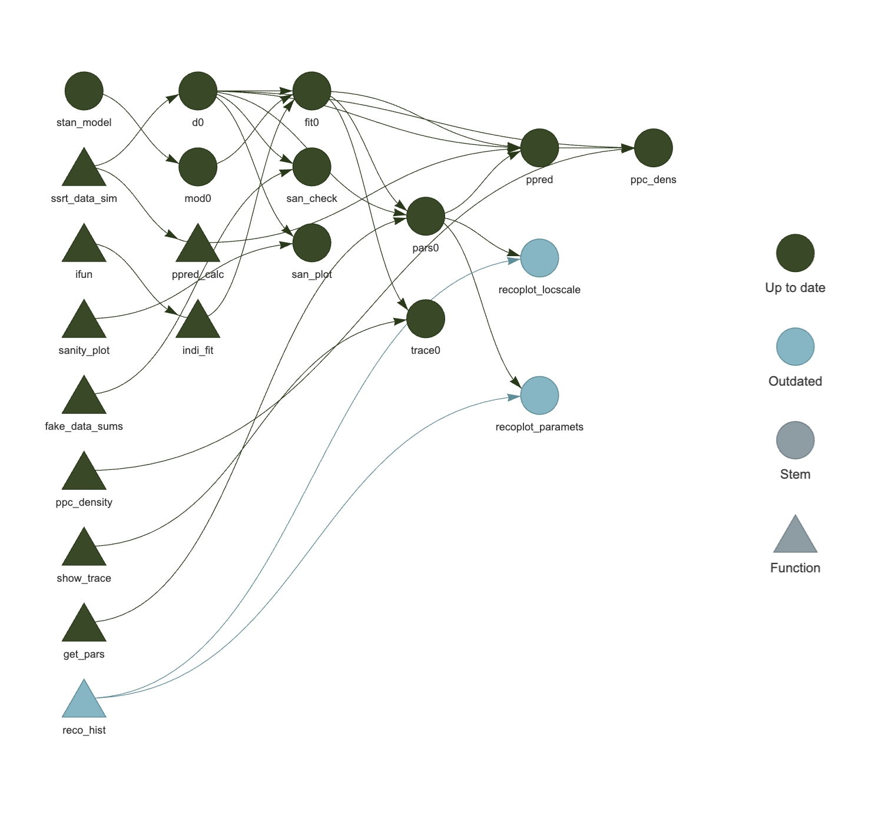

# dbs_combSTIM
Evaluating the effect mid frequency intervention to ventral ("associational") region of STN via DBS combined with high frequency dorsal stimulation on cognition in PD.

The [renv](https://rstudio.github.io/renv/) package was used to create reproducible environment for the project.
To set-up R environment for reproduction of our results, run:

```
install.packages("renv")
renv::restore()
```

The [targets](https://docs.ropensci.org/targets/) package was used to create a reproducible analysis pipeline.
The current pipeline looks as follows:


