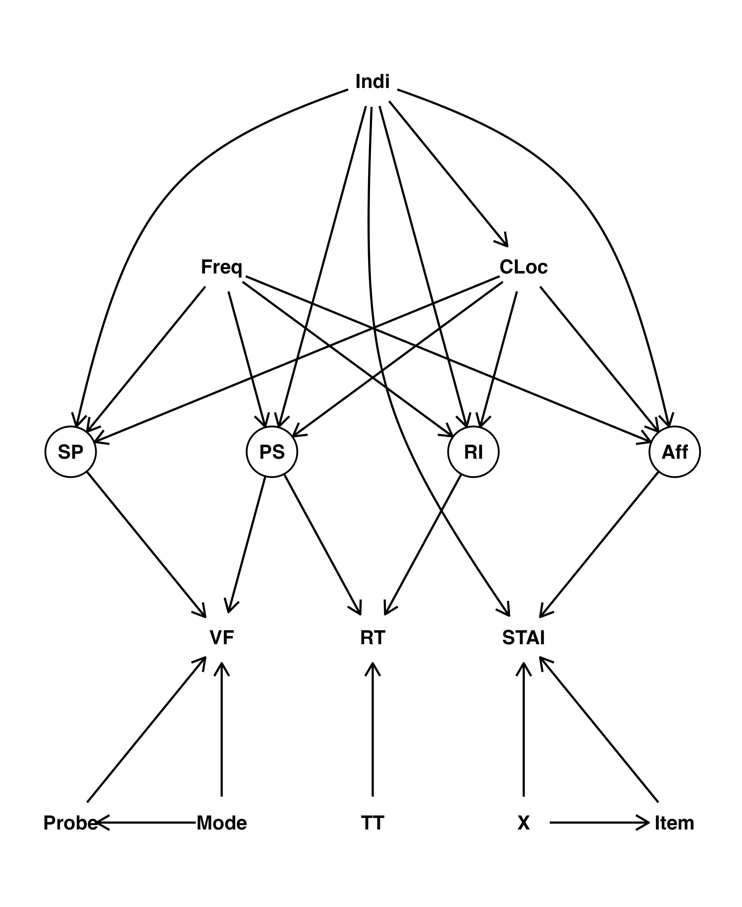

# Combined Stimulation in DBS Patients with PD for Affecting Cognition (dbs-combstim)

Evaluating the effect mid frequency intervention to ventral ('associational') region of STN via DBS combined with high
frequency dorsal stimulation on cognition in PD. Causal assumptions of the system under study are summarised in the
following DAG:



where Indi = Individual, Freq = Stimulation Frequency, CLoc = Contact Location, MS = Motor Speed (latent), PS = Processing
Speed (latent), RI = Response Inhibition (latent), FT = Finger Tapping, RT = Response Time, and TT = Trial Type.


## Research Pipeline

To run the analyses, use the following code:

```
#install.packages("targets")
targets::tar_make()
```

